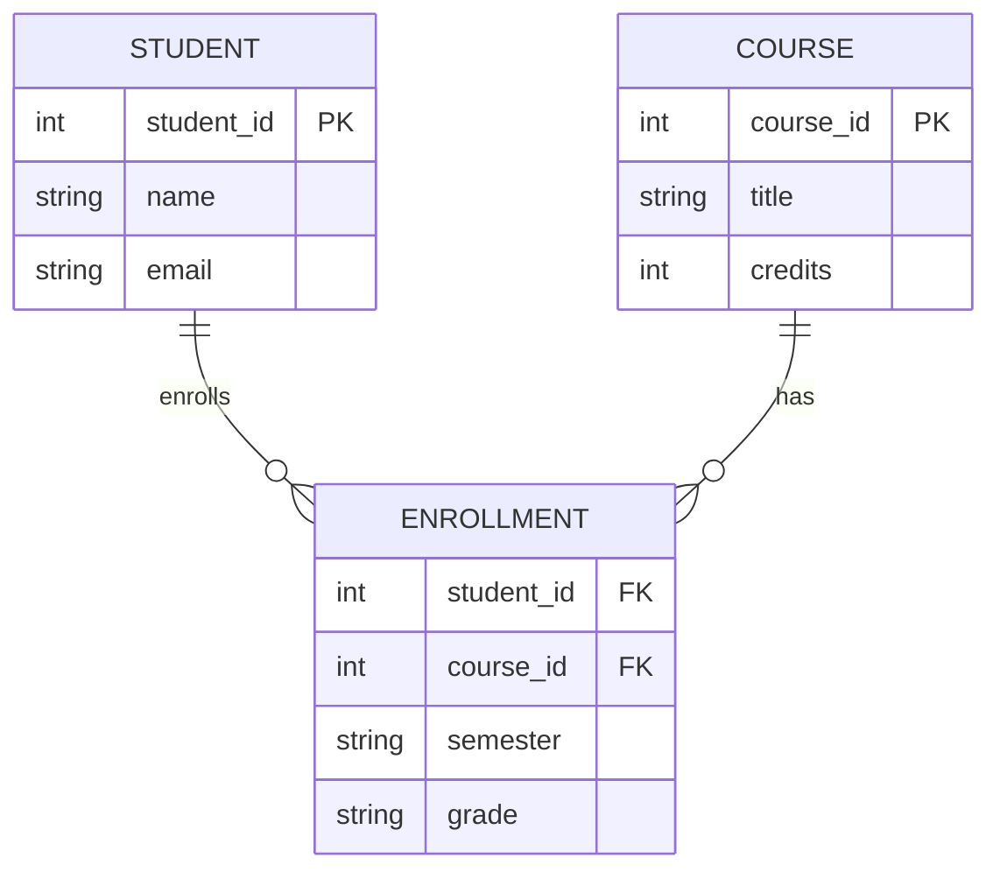

# Difference between Information and Data

Data and Information are important concepts in the world of computing and decision-making.  
**Data** is defined as unstructured information such as text, observations, images, symbols, and descriptions,  
while **Information** refers to processed, organized, and structured data. It gives context to the facts and facilitates decision-making.

---

### What is Data?

Data is a raw and unorganized fact that needs to be processed to make it meaningful.  
It can be considered as facts and statistics collected together for reference or analysis.

> **Definition:**  
> Data are individual units of information. In analytical processes, data are represented by variables.  
> Data is always interpreted (by a human or a machine) to derive meaning — hence, data itself is meaningless.  
> It contains numbers, statements, and characters in a raw form.

---

### What is Information?

Information is structured, organized, and processed data — presented within a context that makes it relevant and useful to the person who needs it.

> **Definition:**  
> Information is the knowledge that is remodeled and classified into an intelligible form, which can be used in the decision-making process.  
> In short, when data becomes purposeful and meaningful, it is called *information*.  

**Sources of Information:** newspapers, the internet, television, people, books, etc.

---

## ⚖️ Difference between Information and Data

| **S.No** | **Data** | **Information** |
|:--:|:--|:--|
| **1** | Data is defined as unstructured information such as text, observations, images, symbols, and descriptions. It provides no specific function and has no meaning on its own. | Information refers to processed, organized, and structured data. It gives context to facts and facilitates decision-making. |
| **2** | Data are the variables that help to develop ideas/conclusions. | Information is meaningful data. |
| **3** | Data are text and numerical values. | Information is a refined form of actual data. |
| **4** | Data doesn't rely on Information. | Information relies on Data. |
| **5** | Measured in bits and bytes. | Measured in meaningful units like time, quantity, etc. |
| **6** | Can be structured as tabular data, graphs, and trees. | Can be structured as language, ideas, and thoughts. |
| **7** | Data does not have any specific purpose. | Information carries a meaning derived from interpreting data. |
| **8** | It is low-level knowledge. | It is the second level of knowledge. |
| **9** | Data does not directly help in decision-making. | Information directly helps in decision-making. |
| **10** | Data is a collection of facts, which itself has no meaning. | Information puts those facts into context. |
| **11** | Example: Student test scores. | Example: Average score of a class derived from the data. |

---

## 📊 Examples of Data vs Information

### **Data Examples**
- **Temperature Readings:** Numbers representing temperature throughout the day — `72°F`, `68°F`, `75°F`.  
- **Student Grades:** A list of scores — `85`, `92`, `78`.  
- **Stock Prices:** Daily closing prices — `$50.25`, `$48.90`, `$52.10`.

### **Information Examples**
- **Weather Report:** Based on the temperature readings, a weather report is generated.  
- **Grade Average:** The average score of the class is derived from the student grades.  
- **Market Analysis:** “The stock market showed a slight increase today” — derived from stock prices.

> In each case, the **raw data** (temperature readings, student grades, stock prices) becomes **meaningful information** after being processed, analyzed, and presented in context.

---

## Structured vs Unstructured Data

Data can broadly be categorized into **Structured Data** and **Unstructured Data** depending on how it is stored, managed, and processed.

---

### 1. Structured Data
Structured data is **organized and stored in a predefined format**, usually in rows and columns (databases, spreadsheets).  
It is easy to search, filter, and analyze using SQL or similar query languages.

- **Characteristics:**
  - Highly organized in tabular form
  - Stored in relational databases
  - Easy to access, process, and analyze
  - Follows a fixed schema

- **Examples:**
  - Employee records (ID, Name, Salary)
  - Banking transactions
  - Sensor readings
  - Inventory databases

---

### 2. Unstructured Data
Unstructured data is **raw and unorganized**. It doesn’t follow a predefined model or schema.  
It is harder to store, search, and analyze directly without preprocessing.

- **Characteristics:**
  - No fixed format
  - Stored as files, media, or documents
  - Requires advanced tools (Big Data, AI/ML, NLP) to process
  - Cannot be easily queried using SQL

- **Examples:**
  - Emails, text documents
  - Images, audio, and video files
  - Social media posts, chats
  - Web pages, logs

---

### Comparison

| **Aspect**       | **Structured Data** | **Unstructured Data** |
|------------------|----------------------|------------------------|
| **Format**       | Predefined schema (tables, rows, columns) | No predefined structure |
| **Storage**      | Relational Databases (RDBMS) | Data lakes, NoSQL, file systems |
| **Ease of Use**  | Easy to enter, query, and analyze | Difficult to process without special tools |
| **Examples**     | Banking records, student database, sales data | Videos, emails, documents, social media posts |
| **Processing**   | Traditional SQL tools | AI/ML, Natural Language Processing, Big Data tools |

---

##  Database

A **Database** is an organized collection of data that is stored and managed electronically.  
It allows users to **store, retrieve, update, and manage** data efficiently using specialized systems called **Database Management Systems (DBMS).**

---

###  Characteristics of a Database
- **Organized Storage:** Data is stored in tables, rows, and columns (in relational systems).  
- **Data Integrity:** Ensures accuracy and consistency of data.  
- **Security:** Controls access with authentication and authorization.  
- **Concurrency:** Allows multiple users to access the data simultaneously.  
- **Scalability:** Can handle small to very large amounts of data.  

---

###  Types of Databases

1. **Relational Database (RDBMS)**  
   - Stores data in tables (rows & columns).  
   - Uses SQL for querying and management.  
   - **Examples:** MySQL, PostgreSQL, Oracle, MS SQL Server.  

2. **NoSQL Database**  
   - Handles unstructured or semi-structured data.  
   - Types include document-based, key-value, columnar, and graph databases.  
   - **Examples:** MongoDB, Cassandra, Redis, Neo4j.  

3. **Hierarchical Database**  
   - Stores data in a tree-like structure.  
   - Each child has only one parent.  
   - **Example:** IBM Information Management System (IMS).  

4. **Network Database**  
   - Data is represented as records connected by links.  
   - Allows many-to-many relationships.  

5. **Cloud Databases**  
   - Hosted and managed on cloud platforms.  
   - Offers scalability, availability, and remote access.  
   - **Examples:** Amazon RDS, Google Cloud SQL, Azure SQL Database.  

---

###  DBMS vs Database

| **Aspect**       | **Database** | **DBMS (Database Management System)** |
|------------------|--------------|---------------------------------------|
| **Definition**   | Collection of data | Software used to manage databases |
| **Function**     | Stores data | Provides tools to create, retrieve, update, and manage data |
| **Nature**       | Passive (just storage) | Active (handles queries, security, transactions) |
| **Example**      | A library of books | A librarian who organizes and helps retrieve books |

---

###  Examples of Database Usage
- **Banking:** Customer accounts, transactions, loans.  
- **Education:** Student records, exam scores, attendance.  
- **E-commerce:** Product catalogs, orders, payments.  
- **Healthcare:** Patient records, prescriptions, medical history.  

---

#  DBMS (Database Management System)

A **Database Management System (DBMS)** is software that allows users to **create, store, organize, manipulate, and retrieve** data in a database.  
It acts as an **interface between the database and the users/applications**.

---

###  Key Functions of a DBMS
- **Data Storage Management:** Efficiently stores data in structured or semi-structured formats.  
- **Data Retrieval:** Allows querying data using languages like SQL.  
- **Data Manipulation:** Supports insert, update, delete operations.  
- **Security & Authorization:** Controls user access with authentication and permissions.  
- **Backup & Recovery:** Protects against data loss and ensures recovery after failure.  
- **Concurrency Control:** Manages simultaneous data access by multiple users.  
- **Data Integrity:** Maintains accuracy and consistency of stored data.  

---

###  Types of DBMS

1. **Relational DBMS (RDBMS)**  
   - Stores data in tables (rows & columns).  
   - Uses SQL for queries.  
   - **Examples:** MySQL, Oracle, PostgreSQL, MS SQL Server.  

2. **NoSQL DBMS**  
   - Designed for unstructured/semi-structured data.  
   - Includes document, key-value, column, and graph databases.  
   - **Examples:** MongoDB, Cassandra, Redis, Neo4j.  

3. **Hierarchical DBMS**  
   - Organizes data in a tree structure (parent-child).  
   - **Example:** IBM IMS.  

4. **Network DBMS**  
   - Represents data as records connected by links (many-to-many).  
   - **Example:** IDMS (Integrated Database Management System).  

---

### 📊 DBMS vs RDBMS

| **Aspect**        | **DBMS** | **RDBMS** |
|-------------------|----------|-----------|
| **Data Storage**  | Stores data as files | Stores data in tables (rows & columns) |
| **Data Redundancy** | High (no normalization) | Low (data normalization reduces redundancy) |
| **Relationships** | No support for relations | Supports relationships via foreign keys |
| **Security**      | Basic security features | Advanced security and authorization |
| **Examples**      | MS Access (non-relational mode), File System DBMS | MySQL, Oracle, PostgreSQL |

---

###  Advantages of DBMS
- Reduces data redundancy  
- Improves data security  
- Easy data sharing among multiple users  
- Enforces integrity constraints  
- Provides backup and recovery mechanisms  

---

###  Disadvantages of DBMS
- Can be complex to implement  
- Requires more memory and processing power  
- Licensing costs may be high  
- Performance can be slower compared to simple file systems for very small datasets  

---

###  Real-Life Applications of DBMS
- **Banking:** Account management, transactions, fraud detection  
- **Airlines:** Reservations, ticketing, schedules  
- **Universities:** Student records, exam results, attendance  
- **E-commerce:** Inventory, orders, payments  
- **Healthcare:** Patient records, prescriptions, billing  

---
#  RDBMS (Relational Database Management System)

A **Relational Database Management System (RDBMS)** is a type of DBMS that stores data in the form of **tables (relations)** consisting of **rows (tuples/records)** and **columns (attributes/fields)**.  
It is the most widely used database model due to its **simplicity, flexibility, and support for relationships**.

---

###  Key Features of RDBMS
- **Tabular Data Storage:** Data is stored in structured tables.  
- **Relationships:** Supports relationships between tables using **primary keys** and **foreign keys**.  
- **SQL Support:** Uses Structured Query Language (SQL) to manage and query data.  
- **Normalization:** Eliminates redundancy and ensures data consistency.  
- **ACID Properties:** Provides **Atomicity, Consistency, Isolation, Durability** for transaction management.  
- **Data Integrity:** Enforces constraints (NOT NULL, UNIQUE, CHECK, DEFAULT, FOREIGN KEY).  

---

###  Components of RDBMS
- **Table:** Collection of rows and columns (like a spreadsheet).  
- **Row (Tuple):** A single record in the table.  
- **Column (Attribute):** A field that defines properties of the data.  
- **Primary Key:** Uniquely identifies each record in a table.  
- **Foreign Key:** Establishes relationship between two tables.  
- **Schema:** Defines the logical structure of the database.  

---

###  Examples of Popular RDBMS
- **Open-Source:** MySQL, PostgreSQL, MariaDB, SQLite  
- **Commercial:** Oracle Database, MS SQL Server, IBM DB2  

---

###  DBMS vs RDBMS

| **Aspect**         | **DBMS** | **RDBMS** |
|---------------------|----------|-----------|
| **Data Storage**    | Files (no tables) | Tables (rows & columns) |
| **Relationships**   | Not supported | Supported via primary & foreign keys |
| **Normalization**   | Not supported | Supported to reduce redundancy |
| **Transactions**    | Limited support | Full ACID compliance |
| **Data Integrity**  | Less emphasis | High emphasis with constraints |
| **Examples**        | File system DBMS, MS Access (basic mode) | MySQL, Oracle, PostgreSQL, SQL Server |

---

###  Advantages of RDBMS
- Easy to understand and use (tabular format)  
- Strong data consistency and accuracy  
- Supports complex queries with SQL  
- Scalable and widely supported  
- Ensures high data security  

---

###  Real-Life Applications of RDBMS
- **Banking:** Transaction management, account data  
- **E-commerce:** Orders, products, and customers  
- **Education:** Student details, courses, grades  
- **Healthcare:** Patient records, billing, treatments  
- **Telecom:** Customer data, billing, call records  

---

##  DBMS vs RDBMS

A **DBMS (Database Management System)** and an **RDBMS (Relational Database Management System)** are both software systems used to manage data,  
but they differ in how data is stored, structured, and related.

---

###  Key Differences

| **Aspect**           | **DBMS** | **RDBMS** |
|-----------------------|----------|-----------|
| **Full Form**         | Database Management System | Relational Database Management System |
| **Data Storage**      | Data is stored as files or collections of records | Data is stored in **tables (rows & columns)** |
| **Relationships**     | Does not support relationships between data | Supports relationships using **primary keys** & **foreign keys** |
| **Data Redundancy**   | High (no normalization) | Low (supports **normalization**) |
| **Query Language**    | May not support SQL | Fully supports **SQL** |
| **Transactions**      | Limited or no ACID compliance | Ensures full **ACID properties** (Atomicity, Consistency, Isolation, Durability) |
| **Integrity Constraints** | Not strongly enforced | Enforces constraints (PRIMARY KEY, FOREIGN KEY, UNIQUE, CHECK) |
| **Data Security**     | Basic security features | Advanced security with role-based access and authorization |
| **Scalability**       | Suitable for small datasets | Suitable for large and complex datasets |
| **Examples**          | File-based systems, MS Access (basic mode) | MySQL, Oracle, PostgreSQL, SQL Server |

---

###  Summary

- **DBMS**: Good for smaller, simpler applications where relationships are not critical.  
- **RDBMS**: Ideal for larger, complex applications requiring **relationships, integrity, and transaction management**.  

---

###  Real-Life Analogy
- **DBMS:** Like a simple **notebook** where you keep unorganized lists of information.  
- **RDBMS:** Like a **spreadsheet** with multiple linked sheets — structured, connected, and easier to analyze.  

---

# Codd's 12 Rules (with Rule 0)

Dr. E.F. Codd defined **12 rules** (plus a foundation **Rule 0**) to determine what qualifies as a **Relational Database Management System (RDBMS)**.  
Together, they form **13 points** in total.

---

## Table: Codd’s Rules (0–12)

| **Rule No.** | **Name**                       | **Meaning (Simple Explanation)** |
|--------------|--------------------------------|----------------------------------|
| **Rule 0**   | Foundation Rule                | Any system that claims to be an RDBMS must manage data only through relational capabilities. |
| **Rule 1**   | Information Rule               | All data should be stored in tables (rows & columns). |
| **Rule 2**   | Guaranteed Access Rule         | Every single piece of data must be accessible by **table name + primary key + column name**. |
| **Rule 3**   | Systematic Null Values         | DBMS must support **NULL** (for missing/unknown data) uniformly. |
| **Rule 4**   | Dynamic Online Catalog         | Metadata (schema info) must also be stored in tables, so users can query it using SQL. |
| **Rule 5**   | Comprehensive Data Sub-language| Must support at least one language (like **SQL**) for data definition, manipulation, and control. |
| **Rule 6**   | View Updating Rule             | Views (virtual tables) must be updatable when possible. |
| **Rule 7**   | High-level Insert, Update, Delete | These operations must work not only on single rows but also on **sets of rows**. |
| **Rule 8**   | Physical Data Independence     | Changes in physical storage (disk, memory) must not affect how applications access data. |
| **Rule 9**   | Logical Data Independence      | Changes in logical structure (like adding new fields) must not break existing applications. |
| **Rule 10**  | Integrity Independence         | Constraints (**PK, FK, etc.**) must be definable in the database, not in the application code. |
| **Rule 11**  | Distribution Independence      | Users should not know whether data is stored locally or distributed across locations. |
| **Rule 12**  | Non-subversion Rule            | If the system provides low-level access (like record-level), it must not bypass relational security/integrity rules. |

---

#  Entity–Relationship (ER) Diagram

An **ER Diagram** models the real-world data of a system using **Entities**, **Attributes**, and **Relationships**.  
It’s used during **conceptual data modeling** to design databases before creating tables.

---

## 🔹 Core Concepts

- **Entity:** A real-world object (e.g., `Student`, `Course`).  
- **Attribute:** A property of an entity (e.g., `Student.name`, `Course.credits`).  
- **Relationship:** How entities are connected (e.g., `Student ENROLLS_IN Course`).  

### Attribute Types
- **Simple vs Composite:** `name` vs `name {first, last}`
- **Single-Valued vs Multi-Valued:** `email` vs `{phone}`  
- **Derived:** Calculated from other data (e.g., `age` from `dob`)  
- **Key Attribute:** Uniquely identifies an entity (underlined)

### Cardinality & Participation
- **1:1, 1:N, M:N** (many-to-many)  
- **Total (mandatory)** vs **Partial (optional)** participation  

### Special Constructs
- **Weak Entity:** Depends on a strong entity; needs **partial key** and **identifying relationship**  
- **ISA (Generalization):** Subtype–supertype (e.g., `Person` ISA `Student`, `Teacher`)

---

##  Notation Cheatsheet

- **Entity:** Rectangle  
- **Weak Entity:** Double rectangle  
- **Relationship:** Diamond  
- **Identifying Relationship:** Double diamond  
- **Attribute:** Oval  
- **Key Attribute:** *Underlined*  
- **Multi-valued Attribute:** Double oval  
- **Derived Attribute:** Dashed oval

---

##  Example: Student–Course Enrollment (ER to Relational)

**Entities**
- `Student(`**`student_id`**`, name, email)`
- `Course(`**`course_id`**`, title, credits)`

**Relationship**
- `ENROLLS_IN(Student, Course, semester, grade)` → **M:N** with attributes

**Relational Mapping**
- `Student(student_id PK, name, email)`
- `Course(course_id PK, title, credits)`
- `Enrollment(student_id FK→Student, course_id FK→Course, semester, grade, PK(student_id, course_id, semester))`

---

##  Mermaid ER (renders on GitHub)



#  ER Diagram with Ellipses (Chen Notation)

In **Chen’s ER model notation**:
- **Entity** → Rectangle  
- **Attribute** → Ellipse (oval)  
- **Key Attribute** → Ellipse with *underlined text*  
- **Relationship** → Diamond  
- **Multi-valued Attribute** → Double ellipse  
- **Derived Attribute** → Dashed ellipse  
---
#  SQL (Structured Query Language)

**SQL** is the standard language to **create**, **read**, **update**, and **delete** data in relational databases.

---

##  What SQL Does

- **Define** structures (tables, views, indexes)  
- **Insert/Read/Update/Delete** rows  
- **Control** permissions and transactions  
- **Query** across multiple tables with **JOINs**

---

## 🧩 SQL Families

- **DDL (Data Definition):** `CREATE`, `ALTER`, `DROP`, `TRUNCATE`  
- **DML (Data Manipulation):** `SELECT`, `INSERT`, `UPDATE`, `DELETE`  
- **DCL (Data Control):** `GRANT`, `REVOKE`  
- **TCL (Transactions):** `BEGIN/START`, `COMMIT`, `ROLLBACK`, `SAVEPOINT`

---

##  Core Building Blocks

### Tables & Keys
- **Primary Key (PK):** uniquely identifies a row  
- **Foreign Key (FK):** references another table’s PK  
- **Constraints:** `NOT NULL`, `UNIQUE`, `CHECK`, `DEFAULT`

### Common Data Types (typical)
- `INT`, `BIGINT`, `DECIMAL(p,s)`, `FLOAT/DOUBLE`  
- `CHAR(n)`, `VARCHAR(n)`, `TEXT`  
- `DATE`, `TIME`, `TIMESTAMP`, `BOOLEAN`

---

## Quick Examples

### 1) Create Schema Objects
```sql
CREATE TABLE students (
  student_id INT PRIMARY KEY,
  name       VARCHAR(100) NOT NULL,
  email      VARCHAR(150) UNIQUE,
  dob        DATE,
  created_at TIMESTAMP DEFAULT CURRENT_TIMESTAMP
);

CREATE TABLE courses (
  course_id  INT PRIMARY KEY,
  title      VARCHAR(120) NOT NULL,
  credits    INT CHECK (credits BETWEEN 1 AND 6)
);

CREATE TABLE enrollments (
  student_id INT,
  course_id  INT,
  semester   VARCHAR(10),
  grade      VARCHAR(2),
  PRIMARY KEY (student_id, course_id, semester),
  FOREIGN KEY (student_id) REFERENCES students(student_id),
  FOREIGN KEY (course_id)  REFERENCES courses(course_id)
);
```
---


# MongoDB

**MongoDB** is a popular **NoSQL, document-oriented database**.  
Instead of tables and rows (like RDBMS), MongoDB stores data in **collections** and **documents (JSON-like format)**.  

---

##  Key Features

- **Document-oriented:** Stores data as JSON/BSON documents.  
- **Schema-less:** Flexible structure; documents in a collection don’t need the same fields.  
- **Collections & Documents:**  
  - *Collection* ≈ Table in RDBMS  
  - *Document* ≈ Row (record)  
- **High Performance:** Optimized for read/write operations.  
- **Horizontal Scalability:** Supports sharding for distributed databases.  
- **Replication:** Automatic failover and data redundancy via replica sets.  
- **Indexing:** Supports single field, compound, geospatial, text indexes.  

---

##  MongoDB Data Model

**Example Document (JSON-like):**
```json
{
  "_id": ObjectId("652abf..."),
  "student_id": 101,
  "name": "Asha Singh",
  "email": "asha@uni.edu",
  "courses": [
    { "course_id": "CSE101", "title": "Databases", "grade": "A" },
    { "course_id": "CSE102", "title": "Networks", "grade": "B+" }
  ],
  "dob": "2003-04-12",
  "created_at": ISODate("2025-09-30T10:00:00Z")
}
